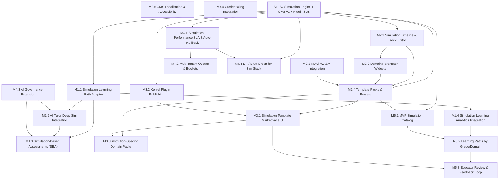

# TutorPutor – Upcoming Modules: Dependency Graph & File-by-File Implementation Plan

Version: 0.1  
Status: Draft for Execution

---

## 1. Dependency Graph for Upcoming Modules

This section models the **next waves of work** as coherent modules and their dependencies, building on the completed Simulation Engine S1–S7.

### 1.1 Module List (Overview)

**Phase 1 – Simulation → Learning Platform Integration**  
- **M1.1 – Simulation Learning-Path Adapter**
- **M1.2 – AI Tutor Deep Simulation Integration**
- **M1.3 – Simulation-Based Assessments (SBA)**
- **M1.4 – Simulation Learning Analytics Integration**

**Phase 2 – Authoring System 2.0**  
- **M2.1 – Simulation Timeline & Block Editor**
- **M2.2 – Domain Parameter Widgets (Physics/Chem/Econ/Bio/Med)**
- **M2.3 – RDKit WASM Full Integration (Chem)**
- **M2.4 – Template Packs & Authoring Presets**
- **M2.5 – Localization & Accessibility Pass for CMS**

**Phase 3 – Marketplace & Plugin Ecosystem**  
- **M3.1 – Simulation Template Marketplace UI**
- **M3.2 – Kernel Plugin Publishing Pipeline**
- **M3.3 – Institution-Specific Domain Packs**
- **M3.4 – Credentialing Integration for Sim-Based Achievements**

**Phase 4 – Platform Observability, Scaling & Governance**  
- **M4.1 – Simulation Performance SLA & Auto-Rollback**
- **M4.2 – Multi-Tenant Simulation Quotas & Resource Buckets**
- **M4.3 – AI Governance Extension (Tutor & Parser)**
- **M4.4 – DR/Blue-Green Integration for Simulation Stack**

**Phase 5 – Content Scaling & Curriculum Rollout**  
- **M5.1 – MVP Simulation Catalog (50–100 Modules)**
- **M5.2 – Structured Learning Paths by Grade/Domain**
- **M5.3 – Educator Review & Feedback Loop**

---

### 1.2 Dependency Graph (Mermaid)

### 1.3 Critical Paths (Narrative)

1. **Simulation → Learning Path → Tutor → SBA**
   - `BASE → M1.1 → M1.2 → M1.3 → M1.4 → M5.2`
2. **Authoring 2.0 → Templates → Marketplace → Content Scale**
   - `BASE → M2.1 → M2.2 + M2.3 → M2.4 → M3.1 → M3.3 → M5.1`
3. **Governance & Reliability**
   - `BASE → M4.1 → M4.2 → M4.4`
   - `BASE → M4.3 → (M1.2, M1.3)`

These paths give you an execution order that maximizes reuse and minimizes rework.

---

## 2. File-by-File Implementation Plan

> NOTE: Paths/names assume the existing monorepo conventions:  
> `products/tutorputor` for product-specific code, `libs/*` for shared libraries, `services/*` for backend services, `apps/*` for frontends.

Each module below lists **(A) new files**, **(B) key modifications**, and **(C) tests**.

---

### 2.1 M1.1 – Simulation Learning-Path Adapter

**Goal:** Treat simulations as first-class learning steps, integrated into the learning path engine.

#### A. New Files

1. `products/tutorputor/contracts/v1/learning-path/simulation-step.schema.json`  
   - JSON schema for a “simulation step” in a learning path.  
   - Fields: `simulationId`, `manifestId`, `domain`, `difficulty`, `skills`, `prerequisites`, `estimatedTimeMinutes`, `assessmentRefs[]`.

2. `products/tutorputor/libs/learning-path/src/simulation-adapter.ts`  
   - Pure functions to map simulation manifests → learning-path steps.  
   - Exports: `toSimulationStep(manifest)`, `inferDifficulty(manifest)`, `inferSkills(manifest)`.

3. `products/tutorputor/services/learning-path/src/routes/simulation-steps.ts`  
   - tRPC/HTTP endpoints:
     - `GET /learning-path/simulation-steps/:userId`
     - `POST /learning-path/plan-from-diagnostic` (uses simulations as building blocks).

4. `products/tutorputor/apps/tutorputor-web/src/features/learning-path/hooks/useSimulationSteps.ts`  
   - React Query hook retrieving simulation-based steps for a learner.

5. `products/tutorputor/apps/tutorputor-web/src/features/learning-path/components/SimulationStepTile.tsx`  
   - UI card showing simulation thumbnail, domain, difficulty, expected time, “Launch simulation” CTA.

#### B. Modifications

1. `products/tutorputor/libs/learning-path/src/models.ts`
   - Add `SimulationStep` union member to existing `LearningStep` type.

2. `products/tutorputor/apps/tutorputor-web/src/pages/dashboard/LearningPathPage.tsx`
   - Render `SimulationStepTile` when step type is `simulation`.
   - Deep-link to `SimulationPlayer` with pre-selected manifest.

#### C. Tests

1. `products/tutorputor/libs/learning-path/__tests__/simulation-adapter.spec.ts`
   - Unit tests for manifest → step mapping (difficulty, skills, prerequisites).

2. `products/tutorputor/services/learning-path/__tests__/simulation-steps.e2e.spec.ts`
   - End-to-end: diagnostic → learning path with simulations.

---

### 2.2 M1.2 – AI Tutor Deep Simulation Integration

**Goal:** Let the tutor “see” simulations as rich context, including entities, parameters, and user actions.

#### A. New Files

1. `products/tutorputor/services/tutor/src/simulation-context-deriver.ts`
   - Logic to summarize simulation state + user actions into tutor context:
     - Entities (nodes, bodies, molecules, compartments etc.).
     - Parameter deltas (e.g., spring constant, dose changes).
     - Derived metrics (e.g., RMSE, AUC, energy changes).

2. `products/tutorputor/services/tutor/src/prompts/simulation-tutor.template.txt`
   - System prompt template focusing on simulation reasoning.

3. `products/tutorputor/apps/tutorputor-web/src/features/simulation-tutor/components/SimulationTutorPanel.tsx`
   - Right-side panel overlay for `SimulationPlayer` with Q&A, hints, and scaffolds.

4. `products/tutorputor/apps/tutorputor-web/src/features/simulation-tutor/hooks/useSimulationTutor.ts`
   - Hook to stream user question + current sim context → tutor service.

#### B. Modifications

1. `products/tutorputor/apps/tutorputor-web/src/features/simulation-player/SimulationPlayer.tsx`
   - Add “Ask Tutor” button to open `SimulationTutorPanel`.
   - Provide callbacks/events for state snapshots to feed into context derivation.

2. `products/tutorputor/services/tutor/src/routes/simulation-tutor.ts`
   - New route that wraps core tutor pipeline with simulation context.

#### C. Tests

1. `products/tutorputor/services/tutor/__tests__/simulation-context-deriver.spec.ts`
   - Ensure correct summarization for each domain (physics, chem, bio/med, econ).

2. `products/tutorputor/apps/tutorputor-web/e2e/simulation-tutor.spec.ts`
   - Open sim → ask question → verify context markers (entities, parameters) in rendered hint.

---

### 2.3 M1.3 – Simulation-Based Assessments (SBA)

**Goal:** Build assessment items that are *driven* by simulations, including parameter changes and predictions.

#### A. New Files

1. `products/tutorputor/contracts/v1/assessments/simulation-item.schema.json`
   - Schema for `SimulationItem`, including:
     - `mode`: prediction / manipulation / explanation
     - `initialStateRef`, `targetStateRef`, `parameterConstraints`
     - `gradingStrategy`: kernel-replay / rubric / CBM weights.

2. `products/tutorputor/libs/assessments/src/simulation-item.ts`
   - Helper functions to construct + validate simulation items.

3. `products/tutorputor/services/assessments/src/simulation-grader.ts`
   - Grading logic using kernel replay + tolerance thresholds (for physics/econ/PK, etc.).

4. `products/tutorputor/apps/tutorputor-web/src/features/assessments/components/SimulationItemView.tsx`
   - UI for simulation-as-question, including CBM confidence selectors.

#### B. Modifications

1. `products/tutorputor/services/assessments/src/routes/attempts.ts`
   - Add branch for `SimulationItem` grading.

2. `products/tutorputor/apps/tutorputor-web/src/features/assessments/AssessmentRunner.tsx`
   - Render `SimulationItemView` when item type is `simulation`.

#### C. Tests

1. `products/tutorputor/services/assessments/__tests__/simulation-grader.spec.ts`
   - Reference scenarios for physics, economics, PK/PD (expected vs student adjustments).

2. `products/tutorputor/apps/tutorputor-web/e2e/simulation-assessment.spec.ts`
   - Run entire assessment with at least one simulation item and verify score.

---

### 2.4 M1.4 – Simulation Learning Analytics Integration

**Goal:** Use simulation telemetry to fuel learner analytics, risk detection, and educator dashboards.

#### A. New Files

1. `products/tutorputor/services/analytics/src/pipelines/simulation-events-etl.ts`
   - ETL from raw sim telemetry → analytics warehouse tables:
     - `simulation_session_summary`
     - `parameter_exploration_metrics`
     - `confusion_zones` (by step/parameter).

2. `products/tutorputor/apps/tutorputor-web/src/features/instructor-dashboard/components/SimulationAnalyticsPanel.tsx`
   - UI for educators: heatmaps, confusion zones, typical paths.

#### B. Modifications

1. `products/tutorputor/services/analytics/src/models.ts`
   - Add models for simulation-derived metrics.

2. `products/tutorputor/apps/tutorputor-web/src/pages/instructor/DashboardPage.tsx`
   - Render `SimulationAnalyticsPanel` when any class uses simulations.

#### C. Tests

1. `products/tutorputor/services/analytics/__tests__/simulation-events-etl.spec.ts`
   - Given sample telemetry, verify aggregate metrics and table rows.

2. `products/tutorputor/apps/tutorputor-web/e2e/instructor-simulation-analytics.spec.ts`
   - Ensure educator dashboard renders correct aggregates for a test class.

---

### 2.5 M2.1 – Simulation Timeline & Block Editor

**Goal:** Give authors a visual timeline editor for simulation steps, less JSON-heavy.

#### A. New Files

1. `products/tutorputor/apps/tutorputor-web/src/features/cms/sim-editor/SimulationTimelineEditor.tsx`
   - Canvas/timeline representing steps with drag-drop, reorder, and grouping.

2. `products/tutorputor/apps/tutorputor-web/src/features/cms/sim-editor/StepPalette.tsx`
   - Palette for domain-specific actions (e.g., APPLY_FORCE, CREATE_BOND, TRANSCRIBE).

3. `products/tutorputor/apps/tutorputor-web/src/features/cms/sim-editor/hooks/useSimulationTimeline.ts`
   - Local state management + schema validation integration.

#### B. Modifications

1. `products/tutorputor/apps/tutorputor-web/src/features/cms/SimulationBlockEditor.tsx`
   - Embed `SimulationTimelineEditor` as primary editing UI, keep JSON editor as “advanced” mode.

#### C. Tests

1. `products/tutorputor/apps/tutorputor-web/src/features/cms/sim-editor/__tests__/SimulationTimelineEditor.spec.tsx`
   - Basic operations (add, delete, reorder, validate).

2. `products/tutorputor/apps/tutorputor-web/e2e/cms-simulation-timeline.spec.ts`
   - Author creates a new sim purely via timeline UI and saves successfully.

---

### 2.6 M2.2 – Domain Parameter Widgets

**Goal:** Replace generic sliders/inputs with domain-aware widgets.

#### A. New Files

1. `products/tutorputor/libs/sim-authoring/src/widgets/PhysicsParameterWidgets.tsx`
   - `GravityWidget`, `MassWidget`, `SpringWidget`, `FrictionWidget`.

2. `products/tutorputor/libs/sim-authoring/src/widgets/ChemistryParameterWidgets.tsx`
   - `TemperatureWidget`, `pHWidget`, `SolventWidget`, `StoichiometryWidget`.

3. `products/tutorputor/libs/sim-authoring/src/widgets/BioMedParameterWidgets.tsx`
   - `DoseScheduleWidget`, `CompartmentWidget`, `R0Widget`, `InterventionTimelineWidget`.

4. `products/tutorputor/libs/sim-authoring/src/widgets/EconParameterWidgets.tsx`
   - `SupplyDemandElasticityWidget`, `TaxSubsidyWidget`, `DelayWidget`.

#### B. Modifications

1. `products/tutorputor/apps/tutorputor-web/src/features/cms/SimulationBlockEditor.tsx`
   - Use domain-specific widgets when editing manifests by domain.

#### C. Tests

1. `products/tutorputor/libs/sim-authoring/__tests__/PhysicsParameterWidgets.spec.tsx` (and analogs per domain).

---

### 2.7 M2.3 – RDKit WASM Full Integration

**Goal:** Upgrade chemistry authoring to use RDKit WASM without fallback limitations.

#### A. New Files

1. `products/tutorputor/services/chemistry-tools/src/rdkit-wasm-loader.ts`
   - RDKit WASM loader with caching and initialization.

2. `products/tutorputor/services/chemistry-tools/src/structure-validation.ts`
   - Utilities: valence check, stereochemistry, substructure search.

#### B. Modifications

1. `products/tutorputor/apps/tutorputor-web/src/features/cms/chemistry/MoleculeDrawer.tsx`
   - Replace fallback-only logic with RDKit-based drawing and validation.

2. `products/tutorputor/sim-runtime/chemistry-kernel.ts`
   - Use RDKit geometry outputs for more accurate 3D rendering hints.

#### C. Tests

1. `products/tutorputor/services/chemistry-tools/__tests__/structure-validation.spec.ts`
   - Known molecules validation (benzene, amino acids, etc.).

---

### 2.8 M2.4 – Template Packs & Presets

**Goal:** Give authors ready-made templates for common simulations.

#### A. New Files

1. `products/tutorputor/content-templates/simulations/physics/*.json`  
   - E.g., `projectile-motion.json`, `harmonic-oscillator.json`.

2. `products/tutorputor/content-templates/simulations/chemistry/*.json`  
   - E.g., `sn1-vs-sn2.json`, `combustion.json`.

3. `products/tutorputor/apps/tutorputor-web/src/features/cms/templates/TemplateBrowser.tsx`

4. `products/tutorputor/apps/tutorputor-web/src/features/cms/templates/hooks/useSimulationTemplates.ts`

#### B. Modifications

1. `products/tutorputor/apps/tutorputor-web/src/features/cms/SimulationBlockEditor.tsx`
   - “Start from template” flow that populates manifest.

#### C. Tests

1. `products/tutorputor/apps/tutorputor-web/e2e/cms-simulation-templates.spec.ts`
   - Author chooses template, tweaks, and publishes.

---

### 2.9 M2.5 – CMS Localization & Accessibility Pass

**Goal:** Make authoring fully localized and accessible.

#### A. New Files

1. `products/tutorputor/apps/tutorputor-web/src/locales/cms/en/sim-editor.json`  
   `.../es/sim-editor.json`, `.../hi/sim-editor.json`, `.../zh/sim-editor.json`

2. `products/tutorputor/apps/tutorputor-web/src/features/cms/a11y/CmsA11yChecklist.tsx`

#### B. Modifications

1. Wrap all CMS components in i18n calls and ensure ARIA roles/labels.

2. Add automated axe-core test for CMS pages.

#### C. Tests

1. `products/tutorputor/apps/tutorputor-web/e2e/cms-a11y-l10n.spec.ts`
   - Check translations and a11y for sim authoring views.

---

### 2.10 M3.1 – Simulation Template Marketplace UI

**Goal:** Expose templates to end users and institutions with ratings and filters.

#### A. New Files

1. `products/tutorputor/services/marketplace/src/routes/simulation-templates.ts`
   - List, filter, rate, favorite templates.

2. `products/tutorputor/apps/tutorputor-web/src/features/marketplace/SimulationTemplateGallery.tsx`
   - Cards with ratings, difficulty, domain, usage stats.

3. `products/tutorputor/apps/tutorputor-web/src/pages/marketplace/SimulationTemplatesPage.tsx`

#### B. Modifications

1. Side nav / global nav linking to the marketplace page.

#### C. Tests

1. `products/tutorputor/services/marketplace/__tests__/simulation-templates.e2e.spec.ts`
2. `products/tutorputor/apps/tutorputor-web/e2e/marketplace-simulation-templates.spec.ts`

---

### 2.11 M3.2 – Kernel Plugin Publishing Pipeline

**Goal:** Let contributors upload/register kernels using the existing SDK.

#### A. New Files

1. `products/tutorputor/services/kernel-registry/src/routes/plugins.ts`
   - Register, update, list kernels and their metadata.

2. `products/tutorputor/services/kernel-registry/src/validation/plugin-policy.ts`
   - Safety rules (resource limits, sandboxing, allowed languages).

3. `products/tutorputor/apps/tutorputor-web/src/features/kernel-registry/PluginSubmissionForm.tsx`

#### B. Modifications

1. `products/tutorputor/sim-sdk/plugin-system.ts`
   - Hook into registry for dynamic loading, version pinning.

#### C. Tests

1. `products/tutorputor/services/kernel-registry/__tests__/plugins.spec.ts`

---

### 2.12 M3.3 – Institution-Specific Domain Packs

**Goal:** Package simulations by institution/tenant.

#### A. New Files

1. `products/tutorputor/services/tenant-config/src/models/domain-pack.ts`
2. `products/tutorputor/services/tenant-config/src/routes/domain-packs.ts`

3. `products/tutorputor/apps/tutorputor-web/src/features/tenant/DomainPackSelector.tsx`

#### C. Tests

1. `products/tutorputor/services/tenant-config/__tests__/domain-packs.spec.ts`

---

### 2.13 M3.4 – Credentialing Integration

**Goal:** Issue credentials for simulation-based achievements.

#### A. New Files

1. `products/tutorputor/services/credentials/src/rules/simulation-achievement-rules.ts`
   - Rules for issuing module/pathway credentials from SBA outcomes.

#### B. Modifications

1. `products/tutorputor/services/credentials/src/routes/issue.ts`
   - Add branch for simulation-based achievements.

#### C. Tests

1. `products/tutorputor/services/credentials/__tests__/simulation-achievements.spec.ts`

---

### 2.14 M4.x – Observability, Scaling & Governance (High Level)

For brevity, only key files:

- `products/tutorputor/services/simulation-monitor/src/perf-sla-enforcer.ts`
- `products/tutorputor/services/simulation-monitor/src/routes/alerts.ts`
- `products/tutorputor/services/tenant-config/src/models/simulation-quota.ts`
- `products/tutorputor/services/tenant-config/src/routes/simulation-quota.ts`
- `products/tutorputor/services/ai-governance/src/models/simulation-model-card.ts`
- `products/tutorputor/services/ai-governance/src/routes/simulation-models.ts`
- `products/tutorputor/infra/terraform/simulation-dr.tf` (DR + blue/green specifics)

---

### 2.15 M5.x – Content Scaling & Curriculum

Key content-oriented artifacts (not exhaustive):

- `products/tutorputor/content-templates/learning-paths/grade-9-math.json`
- `products/tutorputor/content-templates/learning-paths/intro-physics.json`
- `products/tutorputor/content-templates/learning-paths/pre-med-bio.json`
- `products/tutorputor/apps/tutorputor-web/src/features/instructor-feedback/SimulationFeedbackForm.tsx`
- `products/tutorputor/services/feedback/src/routes/simulation-feedback.ts`

---

## 3. Usage Notes

- This document is meant as a **planning + scaffolding reference**.  
- During implementation, always:
  - Respect **reuse-first** and monorepo rules.  
  - Check existing libs under `libs/*` before creating new helpers.  
  - Ensure contracts are versioned under `contracts/v1/*` and tests updated.  
  - Add observability (OTEL/Prometheus) and RBAC checks for new routes.
