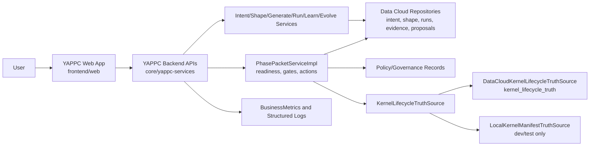
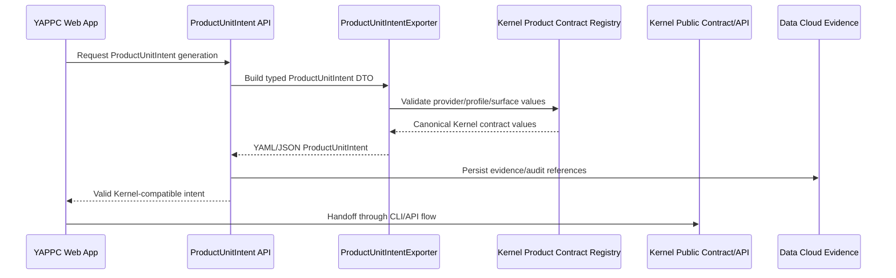
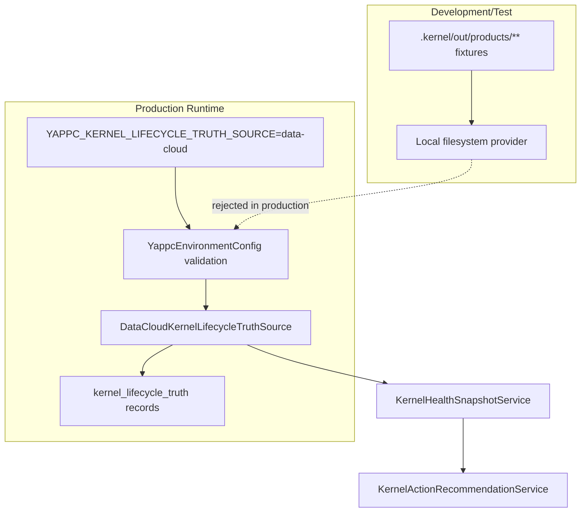
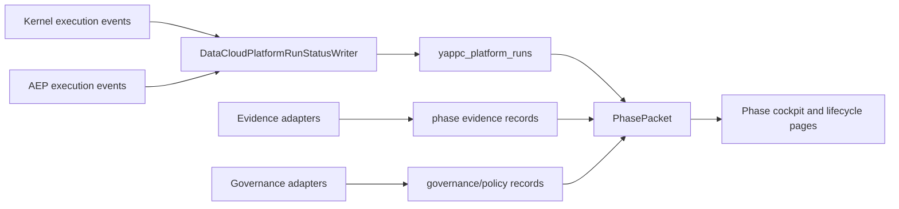

# YAPPC Lifecycle, Kernel, Data Cloud, and AEP Architecture

This document captures the current implementation boundaries for YAPPC lifecycle execution, Kernel handoff, Data Cloud truth, AEP execution evidence, and frontend visibility.

## Lifecycle Control Flow

## Kernel ProductUnitIntent Handoff

## Production Truth Boundary

## Runtime Evidence Loop

## Evidence Links

| Area | Code/Test Evidence |
| --- | --- |
| Kernel contract import/export | `ProductUnitKernelContractRegistryTest`, `ProductUnitIntentExporterTest` |
| Data Cloud Kernel truth | `DataCloudKernelLifecycleTruthSourceTest`, `KernelLifecycleEventIngestServiceTest` |
| Phase packet Data Cloud truth integration | `DataCloudPhasePacketTruthIntegrationTest` |
| Platform run write/read path | `DataCloudPlatformRunStatusWriterTest`, `DataCloudPlatformRunStatusServiceTest` |
| Frontend lifecycle visibility | `phase-cockpit-routes.test.tsx`, `KernelHealthDashboardPage.test.tsx` |
| Release evidence | `generate-yappc-scorecard-evidence.mjs`, `check-yappc-scorecard-evidence.mjs` |