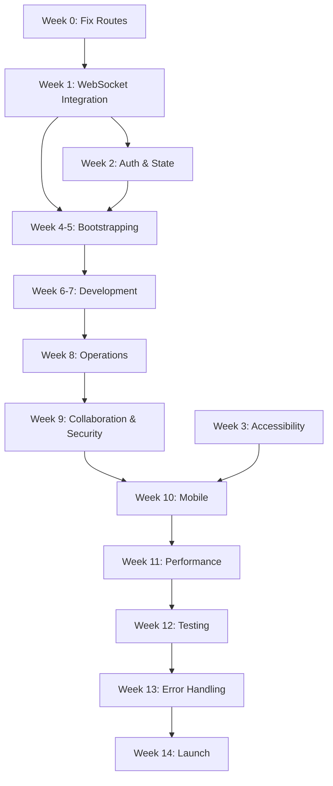

# YAPPC Integrated Implementation Plan
**Date:** 2026-02-03  
**Status:** Backend Foundation Complete, UI/UX Implementation Ready  
**Version:** 2.0

---

## Executive Summary

This plan integrates the **backend infrastructure completion** (database, WebSocket, migrations) with the **UI/UX Production Readiness Plan** to create a unified, actionable roadmap.

### Current State (Updated Feb 3, 2026)

**Backend Infrastructure: ✅ 85% Complete**
- ✅ All 38 database tables created (auth, operations, collaboration, security)
- ✅ WebSocket infrastructure with message routing and handlers
- ✅ Authentication system (90% - needs OAuth)
- ✅ GraphQL server (85% - needs subscriptions)
- ✅ Notification system (60% - backend complete, frontend needed)

**Frontend UI/UX: ⚠️ 45% Complete**
- ✅ Solid architecture and component library (318 components)
- ✅ Pages exist for all phases (49 pages)
- 🚨 **CRITICAL:** Routes ↔ Pages mismatch (navigation broken)
- 🚨 **CRITICAL:** WebSocket client-server integration incomplete
- 🚨 **CRITICAL:** Accessibility violations (WCAG 2.1 AA)
- ⚠️ Mobile responsiveness incomplete
- ⚠️ Testing coverage low (~10%)

### Integration Opportunities

The backend work we just completed **directly enables** several UI/UX critical paths:

1. **WebSocket Real-Time** - Backend handlers ready, need frontend integration
2. **Authentication** - Backend complete, frontend pages exist, need OAuth wiring
3. **Notifications** - Backend service ready, need frontend components
4. **Database Schema** - All tables ready, need frontend CRUD operations
5. **Canvas Collaboration** - Backend handler ready, need frontend CRDT integration

---

## Unified Implementation Timeline

### 🚨 Week 0 (Days 1-2): CRITICAL - Unblock Navigation

**Goal:** Fix broken routes to enable basic app navigation

**Tasks:**
- [ ] Audit `apps/web/src/router/routes.tsx` against actual page files
- [ ] Fix all missing/renamed imports (bootstrapping, initialization, development, operations, collaboration, security)
- [ ] Add routes for implemented but unreachable pages
- [ ] Add CI check to prevent route import failures
- [ ] Test navigation flows end-to-end

**Deliverable:** App navigates without runtime errors

**Owner:** Frontend Lead  
**Effort:** 2 days  
**Blocker:** None - START IMMEDIATELY

---

### Phase 1: Foundation Integration (Weeks 1-3)

#### Week 1: WebSocket & Real-Time Integration

**Backend Status:** ✅ Complete (MessageRouter, PresenceManager, 3 handlers)  
**Frontend Status:** ⚠️ Partial (client adapters exist, not wired)

**Tasks:**
- [ ] **Integrate WebSocket Client with Backend**
  - Update frontend WebSocket client to use backend `/ws` endpoint
  - Implement authentication handshake (tenantId, userId from JWT)
  - Wire MessageRouter message types to frontend handlers
  - Test reconnection logic with backend ConnectionManager

- [ ] **Canvas Collaboration Integration**
  - Connect frontend canvas to CanvasCollaborationHandler
  - Implement join/leave session flows
  - Wire cursor tracking to PresenceManager
  - Test real-time canvas updates (nodes, edges, selections)
  - Add presence indicators UI

- [ ] **Chat Integration**
  - Connect frontend chat UI to ChatHandler
  - Implement typing indicators
  - Wire reactions and threading
  - Test message delivery and read receipts

- [ ] **Notification Integration**
  - Create NotificationBell component
  - Create NotificationPanel component
  - Wire to backend NotificationHandler
  - Implement real-time notification delivery
  - Add notification preferences UI

**Deliverable:** End-to-end real-time features working

**Dependencies:** Backend WebSocket infrastructure (✅ Complete)  
**Owner:** Full-stack team (2 backend + 2 frontend)  
**Effort:** 5 days

---

#### Week 2: Authentication & State Management

**Backend Status:** ✅ 90% Complete (needs OAuth providers)  
**Frontend Status:** ✅ Pages exist, needs OAuth wiring

**Tasks:**
- [ ] **OAuth Integration**
  - Implement Google OAuth flow (backend + frontend)
  - Implement GitHub OAuth flow (backend + frontend)
  - Test OAuth callbacks and token exchange
  - Add OAuth provider selection UI

- [ ] **Email Service Integration**
  - Integrate SendGrid or AWS SES
  - Implement email verification flow
  - Implement password reset emails
  - Test email delivery and templates

- [ ] **State Management Completion**
  - Complete all phase-specific Jotai atoms
  - Implement IndexedDB persistence layer
  - Add optimistic update patterns
  - Create error boundary wrappers
  - Test offline state sync

**Deliverable:** Complete authentication system with OAuth

**Dependencies:** Backend auth tables (✅ Complete)  
**Owner:** Full-stack team  
**Effort:** 5 days

---

#### Week 3: Accessibility Baseline

**Current Status:** 🚨 30/100 (Critical violations)  
**Target:** ✅ 80/100 (WCAG 2.1 AA baseline)

**Tasks:**
- [ ] **Component Accessibility Audit**
  - Run axe-core on all 318 components
  - Fix ARIA label violations
  - Add keyboard navigation to all interactive elements
  - Implement focus management system
  - Add skip links and landmarks

- [ ] **Page Accessibility**
  - Test all 49 pages with screen readers (NVDA, VoiceOver)
  - Fix color contrast violations
  - Add form field associations
  - Implement focus traps in modals
  - Document keyboard shortcuts

- [ ] **Automated Testing**
  - Add axe-core to CI pipeline
  - Create accessibility test suite
  - Set up regression testing
  - Document accessibility patterns

**Deliverable:** WCAG 2.1 AA compliant foundation

**Owner:** Frontend + QA team  
**Effort:** 5 days

---

### Phase 2: Page Implementation & Integration (Weeks 4-9)

#### Week 4-5: Bootstrapping & Initialization

**Backend Status:** ✅ Database tables ready, ⚠️ AI services needed  
**Frontend Status:** ✅ 10 bootstrapping pages, 5 initialization pages exist

**Tasks:**
- [ ] **Wire Existing Pages to Router**
  - Bootstrapping: UploadDocs, ImportFromURL, TemplateSelection, ResumeSession, Export, Complete
  - Initialization: Wizard, Presets, Progress, Complete, Rollback

- [ ] **Backend Service Integration**
  - Create BootstrappingService (conversation, graph generation)
  - Create InitializationService (project provisioning)
  - Wire GraphQL mutations to services
  - Test CRUD operations with database

- [ ] **Canvas CRDT Integration**
  - Integrate Yjs for collaborative editing
  - Implement awareness protocol (cursors, presence)
  - Add version history
  - Test conflict resolution

- [ ] **Complete Missing Pages**
  - Add TemplateGalleryPage (or remove from router)
  - Add ProjectPreviewPage (or remove from router)
  - Decide on wizard vs separate pages for initialization

**Deliverable:** Functional bootstrapping and initialization flows

**Dependencies:** WebSocket integration (Week 1), Database tables (✅ Complete)  
**Owner:** Full-stack team  
**Effort:** 10 days

---

#### Week 6-7: Development Phase

**Backend Status:** ✅ Database tables ready, ⚠️ GitHub integration needed  
**Frontend Status:** ✅ 13 development pages exist

**Tasks:**
- [ ] **Wire Existing Pages**
  - Sprint: Planning, List, Board, Retro
  - Code Review: Dashboard, Detail
  - Deployments: List, Detail
  - Velocity: Charts

- [ ] **Backend Service Integration**
  - Create SprintService (CRUD, velocity calculations)
  - Create StoryService (CRUD, assignments)
  - Create CodeReviewService (GitHub/GitLab integration)
  - Create DeploymentService (tracking, status)

- [ ] **Add Missing Pages**
  - EpicsPage (or remove from router)
  - PullRequestsPage, PullRequestDetailPage
  - ReleasesPage
  - TestResultsPage

- [ ] **GitHub/GitLab Integration**
  - Implement OAuth for GitHub/GitLab
  - Create webhook handlers
  - Sync PRs and deployments
  - Test integration end-to-end

**Deliverable:** Functional development workflow

**Dependencies:** Database tables (✅ Complete), Integration tables (✅ Complete)  
**Owner:** Full-stack team  
**Effort:** 10 days

---

#### Week 8: Operations Phase

**Backend Status:** ✅ All operations tables ready (metrics, logs, incidents, alerts)  
**Frontend Status:** ✅ 9 operations pages exist

**Tasks:**
- [ ] **Wire Existing Pages**
  - Dashboards: Ops, Operations
  - Observability: Metrics, Logs, Traces, Alerts
  - Incidents: List, Detail

- [ ] **Backend Service Integration**
  - Create MetricsService (collection, aggregation)
  - Create LogService (aggregation, search)
  - Create IncidentService (management, timeline)
  - Create AlertService (rules, triggers)

- [ ] **Add Missing Pages**
  - WarRoomPage
  - OnCallPage
  - StatusPage
  - RunbooksPage, RunbookDetailPage
  - DashboardsPage, DashboardEditorPage

- [ ] **Real-Time Metrics**
  - Wire metrics to WebSocket for live updates
  - Implement chart auto-refresh
  - Add alert notifications

**Deliverable:** Functional operations monitoring

**Dependencies:** Database tables (✅ Complete), WebSocket (Week 1)  
**Owner:** Full-stack team  
**Effort:** 5 days

---

#### Week 9: Collaboration & Security

**Backend Status:** ✅ All tables ready (teams, channels, chat, security)  
**Frontend Status:** ✅ 7 collaboration pages, 5 security pages exist

**Tasks:**
- [ ] **Collaboration - Wire Existing Pages**
  - Team: Dashboard, Chat, Calendar, Settings
  - Knowledge: KnowledgeBase
  - Communication: Notifications, Integrations

- [ ] **Collaboration - Backend Services**
  - Create TeamService (CRUD, members)
  - Create ChatService (messages, channels)
  - Create DocumentService (wiki, versioning)
  - Wire to ChatHandler for real-time

- [ ] **Security - Wire Existing Pages**
  - SecurityDashboard
  - Vulnerabilities
  - Compliance
  - AccessControl
  - AuditLogs

- [ ] **Security - Backend Services**
  - Create SecurityScanService (integration with Snyk/OWASP)
  - Create ComplianceService (framework checks)
  - Create AuditLogService (tracking, search)
  - Create ThreatDetectionService

**Deliverable:** Functional collaboration and security features

**Dependencies:** Database tables (✅ Complete), WebSocket (Week 1)  
**Owner:** Full-stack team  
**Effort:** 5 days

---

### Phase 3: Polish & Optimization (Weeks 10-12)

#### Week 10: Mobile Responsiveness

**Current Status:** 🚨 40/100 (Desktop-first, mobile broken)  
**Target:** ✅ 85/100 (Mobile-optimized)

**Tasks:**
- [ ] **Responsive Layouts**
  - Audit all 49 pages for mobile breakpoints
  - Implement mobile navigation patterns
  - Add touch gesture support
  - Test on real devices (iOS, Android)

- [ ] **Mobile-Specific Features**
  - Implement PWA manifest
  - Add service worker for offline
  - Optimize touch targets (44px minimum)
  - Add mobile-specific canvas controls

**Deliverable:** Mobile-responsive app

**Owner:** Frontend team  
**Effort:** 5 days

---

#### Week 11: Performance Optimization

**Current Status:** ⚠️ 50/100 (Not measured)  
**Target:** ✅ 90/100 (Lighthouse > 90)

**Tasks:**
- [ ] **Performance Audit**
  - Run Lighthouse on all key pages
  - Analyze bundle with webpack-bundle-analyzer
  - Measure Core Web Vitals

- [ ] **Optimization**
  - Implement code splitting per phase
  - Optimize images (WebP, lazy loading)
  - Add resource hints (preload, prefetch)
  - Implement virtual scrolling for large lists
  - Add performance monitoring (Web Vitals)

- [ ] **Performance Budget**
  - Set bundle size limits (< 300KB initial)
  - Set TTI target (< 3.5s)
  - Set LCP target (< 2.5s)
  - Add Lighthouse CI to pipeline

**Deliverable:** Fast, optimized app (Lighthouse > 90)

**Owner:** Frontend + DevOps team  
**Effort:** 5 days

---

#### Week 12: Testing & QA

**Current Status:** 🚨 35/100 (< 10% coverage)  
**Target:** ✅ 80/100 (> 70% coverage)

**Tasks:**
- [ ] **Unit Tests**
  - Test all 318 components (target 80% coverage)
  - Test all Jotai atoms
  - Test all hooks
  - Test utility functions

- [ ] **Integration Tests**
  - Test critical user flows (auth, bootstrapping, canvas)
  - Test API integrations
  - Test WebSocket message flows
  - Test state persistence

- [ ] **E2E Tests**
  - Expand Playwright test suite
  - Test all 6 phase workflows
  - Test cross-browser (Chrome, Firefox, Safari)
  - Test mobile flows

- [ ] **Visual Regression**
  - Set up Chromatic or Percy
  - Capture all component states
  - Add to CI pipeline

- [ ] **Accessibility Tests**
  - Automate axe-core tests
  - Add to CI pipeline
  - Manual screen reader testing

**Deliverable:** Comprehensive test coverage (> 70%)

**Owner:** QA team + All developers  
**Effort:** 5 days

---

### Phase 4: Production Hardening (Weeks 13-14)

#### Week 13: Error Handling & Monitoring

**Tasks:**
- [ ] **Error Handling**
  - Implement retry logic with exponential backoff
  - Add user-friendly error messages
  - Create error boundaries for all routes
  - Implement fallback UI for failures

- [ ] **Monitoring**
  - Integrate Sentry error tracking
  - Set up performance monitoring
  - Add custom metrics
  - Create alerting rules

- [ ] **Logging**
  - Implement structured logging
  - Add correlation IDs
  - Set up log aggregation
  - Create dashboards

**Deliverable:** Production-ready error handling and monitoring

**Owner:** Full-stack + DevOps team  
**Effort:** 5 days

---

#### Week 14: Launch Readiness

**Tasks:**
- [ ] **Security Audit**
  - OWASP Top 10 review
  - Penetration testing
  - Dependency vulnerability scan
  - Security headers validation

- [ ] **Performance Testing**
  - Load testing (1000+ concurrent users)
  - Stress testing
  - Soak testing (24+ hours)
  - WebSocket scalability testing

- [ ] **Accessibility Audit**
  - Manual WCAG 2.1 AA audit
  - Screen reader testing
  - Keyboard navigation testing
  - Color contrast validation

- [ ] **Browser Compatibility**
  - Test on Chrome, Firefox, Safari, Edge
  - Test on iOS Safari, Android Chrome
  - Fix cross-browser issues

- [ ] **Documentation**
  - User guides for all 6 phases
  - Admin documentation
  - API documentation
  - Deployment guide

- [ ] **Staging Deployment**
  - Deploy to staging environment
  - Run smoke tests
  - Performance validation
  - Security validation

**Deliverable:** Production-ready application

**Owner:** All teams  
**Effort:** 5 days

---

## Critical Path Dependencies

---

## Success Criteria

### Week 14 Production Go/No-Go Checklist

**Must-Have (Blockers):**
- [ ] ✅ All routes navigate without errors
- [ ] ✅ WebSocket real-time communication stable
- [ ] ✅ Canvas collaboration working with CRDT
- [ ] ✅ All 6 phases have functional MVP pages
- [ ] ✅ WCAG 2.1 Level AA compliant (automated + manual)
- [ ] ✅ Mobile responsive (all critical flows)
- [ ] ✅ Lighthouse score > 85 on all key pages
- [ ] ✅ Test coverage > 70% (unit + integration + E2E)
- [ ] ✅ Zero P0/P1 bugs
- [ ] ✅ Error monitoring operational (Sentry)
- [ ] ✅ Security audit passed (OWASP Top 10)
- [ ] ✅ Load testing passed (1000+ users)

**Nice-to-Have (Post-Launch):**
- [ ] Offline mode (PWA with service worker)
- [ ] Desktop app (Electron/Tauri)
- [ ] Advanced analytics
- [ ] AI-powered features
- [ ] Multi-language support

---

## Risk Mitigation

| Risk | Impact | Likelihood | Mitigation |
|------|--------|------------|------------|
| **Routes remain broken** | 🔴 Critical | High | Week 0 dedicated fix, CI check prevents regression |
| **WebSocket integration fails** | 🔴 Critical | Medium | Backend complete, fallback to HTTP polling |
| **Canvas collaboration fails** | 🔴 Critical | Medium | Yjs proven, prototype in Week 2, fallback to view-only |
| **OAuth integration delays** | 🟡 High | Medium | Email/password works, OAuth is enhancement |
| **Mobile responsiveness incomplete** | 🟡 High | Medium | Desktop-first MVP, mobile in Week 10 |
| **Testing coverage low** | 🟡 High | High | Week 12 dedicated sprint, require tests for new code |
| **Performance issues** | 🟡 High | Medium | Week 11 optimization, monitoring from Week 1 |
| **Accessibility violations** | 🔴 Critical | Low | Week 3 sprint, ongoing audits, CI checks |

---

## Resource Allocation

**Team Composition:**
- 2 Backend Engineers (Java, GraphQL, WebSocket)
- 3 Frontend Engineers (React, TypeScript, UI/UX)
- 1 Full-Stack Engineer (Integration, DevOps)
- 1 QA Engineer (Testing, Automation)
- 1 UI/UX Designer (Design, Accessibility)

**Total:** 8 people × 14 weeks = 112 person-weeks

---

## Key Metrics

### Weekly Progress Tracking

| Week | Backend % | Frontend % | Integration % | Testing % | Overall % |
|------|-----------|------------|---------------|-----------|-----------|
| 0 | 85 | 45 | 30 | 10 | 42 |
| 1 | 90 | 55 | 60 | 15 | 55 |
| 2 | 95 | 65 | 70 | 20 | 62 |
| 3 | 95 | 75 | 75 | 25 | 67 |
| ... | ... | ... | ... | ... | ... |
| 14 | 100 | 95 | 95 | 80 | 92 |

---

## Next Actions (Immediate)

### Day 1 (Today)
1. ✅ Review this integrated plan with team
2. ✅ Assign Week 0 route fixing task
3. ✅ Set up CI check for route validation
4. ✅ Begin route audit

### Day 2
1. Complete route fixes
2. Test navigation end-to-end
3. Begin Week 1 WebSocket integration planning
4. Set up project tracking (Jira/Linear)

### Week 1 Kickoff
1. Backend team: Support WebSocket integration
2. Frontend team: Wire WebSocket clients
3. Full-stack: Canvas collaboration integration
4. QA: Set up testing infrastructure

---

## Conclusion

This integrated plan combines:
- ✅ **Completed backend infrastructure** (38 tables, WebSocket, auth)
- ⚠️ **Existing frontend foundation** (318 components, 49 pages)
- 🚨 **Critical fixes** (routes, accessibility, mobile)
- 🎯 **Clear path to production** (14 weeks, measurable milestones)

**Key Success Factors:**
1. Fix routes in Week 0 (unblock navigation)
2. Integrate WebSocket in Week 1 (enable real-time)
3. Complete accessibility in Week 3 (avoid legal risk)
4. Wire all pages by Week 9 (functional MVP)
5. Optimize and test in Weeks 10-12 (production quality)
6. Harden and launch in Weeks 13-14 (go-live)

**Status:** Ready to execute. Backend foundation is solid. Frontend needs integration and polish. Clear path to production in 14 weeks.
