# TutorPutor Architecture Review — Latest `samujjwal/ghatana`

**Repository reviewed:** `samujjwal/ghatana`  
**Ref observed through GitHub connector:** `a3e3c3ed9c57ce714eb75062f595742fb67ed4d0`  
**Date:** 2026-04-25  
**Scope:** `products/tutorputor/**`, TutorPutor-specific docs, platform service, gateway, learner/admin apps, simulation/content/AI surfaces, CI/deployment docs, current-state and audit-remediation docs.

> This document supersedes the previous review that was based on `samujjwal/ghatana-old`. The current review is based only on the latest `samujjwal/ghatana` repository evidence available through the GitHub connector.

---

## 1. Executive Summary

TutorPutor in `samujjwal/ghatana` has evolved significantly beyond the older repo. The latest repo positions TutorPutor as a **simulation-first, AI-assisted adaptive learning platform** with a consolidated backend, learner web app, admin authoring app, simulation engine, AI/content generation pipeline, SSO/LTI/payment/notification integrations, and a substantial Prisma-backed domain model.

The strategic product direction is correct: TutorPutor should not compete as another content repository. The platform should solve the new education problem created by abundant AI and knowledge access: learners no longer primarily need help finding information; they need help building reasoning, judgment, confidence calibration, simulation-backed understanding, ethical AI use, and transferable skill.

The current architecture shows strong progress toward that direction:

- A **consolidated modular monolith** backend (`tutorputor-platform`) is the main runtime boundary.
- A thin **API gateway** fronts platform APIs for web/mobile/admin clients.
- **Learner web**, **admin authoring**, **mobile foundation**, and **simulation engine** surfaces exist.
- **Content Studio** supports learning experiences, claims, examples, simulations, animations, validation, publish gates, review gates, provenance, and AI generation.
- **Simulation-first learning** is explicitly modeled through manifests, learning units, claim/evidence/task structures, confidence-based marking, viva triggers, telemetry, and learner journeys.
- **Enterprise-readiness** is partially present through JWT/SSO, LTI 1.3, Stripe billing, tenant configuration, audit/compliance modules, notifications, and deployment/CI docs.
- The April 20 remediation document indicates several P0/P1 audit issues were addressed, including consent enforcement registration, strict AI route context, auth refresh/logout route availability, real bearer-token E2E coverage, and content-generation launcher health/readiness smoke coverage.

However, the architecture still needs hardening before it should be considered fully production-grade:

- The repo contains multiple truth surfaces that do not fully agree: `CURRENT_STATE.md`, the March module inventory, April audit, April remediation notes, and `tsc_probe.txt` describe different levels of readiness.
- Some evidence indicates broad module gates previously failed, while later docs say targeted and broader remediation passed. This must be settled by a single current CI-generated status report.
- The Content Studio and AI generation pipeline is broad, but still needs deeper golden-dataset validation, deterministic replay, content provenance, independent evaluator governance, and simulation/scientific correctness regression suites.
- Trust boundaries, consent, role/ABAC, tenant isolation, and AI/content worker topology must remain non-negotiable acceptance gates.
- UI/UX has strong feature breadth, but the product must simplify around outcome-first learner journeys and low-cognitive-load authoring.

**Architecture verdict:** TutorPutor has a strong and ambitious architecture with many implemented product capabilities, but it should be described as **advanced partial-production maturity**, not fully done. The next phase should focus on: trustworthy learning evidence, fail-closed security/privacy, validated content generation, deterministic simulation correctness, CI truth consolidation, and UX simplification.

---

## 2. Corrected Product Thesis

### 2.1 Problem TutorPutor Should Solve

Knowledge access is now cheap and abundant. ChatGPT, Claude, search, video platforms, open textbooks, and learning websites make information easy to retrieve. The hard problem is no longer “how do we get information to students?” The hard problem is:

> How do we help the new generation learn how to think, ask, verify, reason, simulate, create, collaborate, adapt, and prove real competence in a world where answers are instantly available?

TutorPutor should be positioned as a **Learning Adaptation and Evidence Platform** for the AI-abundant era.

### 2.2 Product Mission

TutorPutor should help learners transition from passive information consumption to active capability development through this loop:

```mermaid
flowchart LR
  A[Intent / Goal] --> B[Diagnostic]
  B --> C[Adaptive Path]
  C --> D[Visual Concept]
  D --> E[Simulation / Experiment]
  E --> F[Prediction + Confidence]
  F --> G[Run / Observe]
  G --> H[Explain / Construct]
  H --> I[Evidence + Assessment]
  I --> J[Feedback / Remediation]
  J --> K[Transfer Project]
  K --> L[Credential / Mastery Record]
  L --> C
```

### 2.3 Learning Model Shift

| Old Model | TutorPutor Target Model |
|---|---|
| Content delivery | Simulation-first exploration |
| Memorization and answer recall | Reasoning, prediction, explanation, construction |
| One-size-fits-all path | Adaptive, evidence-driven path |
| Quiz-only evaluation | CBM, process telemetry, viva, simulation tasks, transfer projects |
| AI as optional chatbot | AI as embedded tutor, authoring assistant, evaluator, reviewer, and remediation engine |
| Teacher as content source | Teacher as mentor, reviewer, facilitator, and governance actor |
| Completion certificate | Evidence-backed competency record |

---

## 3. Latest Repository Evidence Reviewed

Primary repository evidence reviewed from `samujjwal/ghatana`:

| Evidence | Meaning |
|---|---|
| `products/tutorputor/docs/architecture/CURRENT_STATE.md` | Current state truth surface; says TutorPutor is a monorepo product with `tutorputor-platform`, web, admin, core, simulation, and contracts; route/API state is mostly implemented. |
| `products/tutorputor/docs/audit/TUTORPUTOR_DEEP_PRODUCT_REALITY_AUDIT_2026-04-19.md` | Critical audit; identifies partial production maturity, trust gaps, auth/consent/content-generation runtime concerns, and product simplification needs. |
| `products/tutorputor/docs/audit/TUTORPUTOR_AUDIT_REMEDIATION_PROGRESS_2026-04-20.md` | Follow-up remediation; reports several audit items were already fixed or fixed in this pass, with targeted Vitest/Playwright/Gradle verification. |
| `products/tutorputor/docs/architecture/specs/PRODUCT_SPEC.md` | Reverse-engineered product spec; describes simulation-first AI learning platform, C4 architecture, domain model, 106 DB models, learning engine, CBM, viva, simulation engine, plugin architecture. |
| `products/tutorputor/docs/architecture/TUTORPUTOR_MODULE_INVENTORY.md` | March 8 module inventory; useful for inventory, but readiness status appears older than later remediation/current-state docs. |
| `products/tutorputor/docker-compose.yml` | Canonical local app-stack topology: postgres, redis, content-generation, platform, gateway, web, admin. |
| `products/tutorputor/docs/guides/DEVELOPMENT_SETUP.md` | Development topology and `ttr` commands; documents critical journey E2E runner. |
| `products/tutorputor/docs/guides/DEPLOYMENT.md` | Deployment guidance; documents supported local topology, env vars, health, metrics, Stripe, and validation checklist. |
| `products/tutorputor/.gitea/workflows/tutorputor-ci.yml` | CI intent: shared package validation, tests, coverage gate, Docker image builds, Trivy security scan. |
| `products/tutorputor/services/tutorputor-platform/src/clients/ai-client.ts` | Platform AI gRPC client with proto loading, typed request/response interfaces, circuit breaker, fallback, and logger. |
| `products/tutorputor/services/tutorputor-platform/src/workers/content/grpc/RealContentGenerationClient.ts` | Production gRPC client for content generation/validation workers with retries, proto resolution, normalization, and response transformation. |
| `products/tutorputor/services/tutorputor-platform/tsc_probe.txt` | Compiler-error probe artifact. It conflicts with newer remediation/current-state claims, so it should be treated as a stale or unresolved diagnostic until replaced by fresh CI evidence. |

---

## 4. Current Architecture Overview

### 4.1 C4 Level 1 — System Context

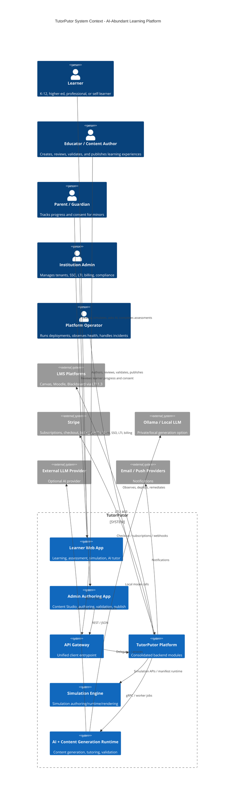

### 4.2 C4 Level 2 — Container Architecture

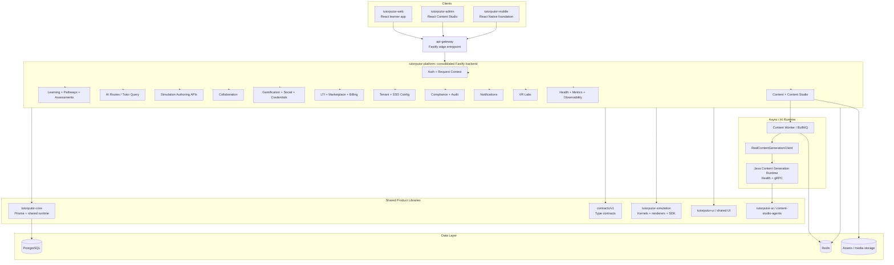

### 4.3 Canonical Runtime Topology

The latest `docker-compose.yml` defines a source-backed app stack with:

- `postgres` on configurable host port, default 5432.
- `redis` on configurable host port, default 6379.
- `content-generation` Java service on gRPC 50051 and health 8081.
- `platform` on 7105, with `CONTENT_WORKER_ENABLED=true`, `CONTENT_QUEUE_DISABLED=false`, and `GRPC_SERVER_ADDRESS=content-generation:50051`.
- `api-gateway` on 3200, with worker disabled but queue not disabled.
- `web` on 3201 with `VITE_API_BASE_URL=http://127.0.0.1:3200/api`.
- `admin` on 3202 with dev auth bypass and tenant configuration for local flows.

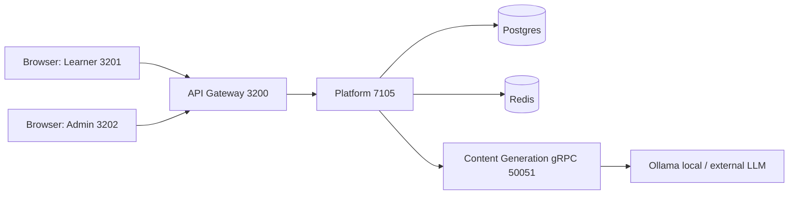

### 4.4 API Namespace Strategy

The latest `CURRENT_STATE.md` states that API routes are exposed under `/api/v1/`, while some product-specific routes remain under `/api/content-studio` and `/api/sim-author`. The practical route picture is:

| Namespace | Purpose | Status in Current State |
|---|---|---|
| `/api/v1/auth` | JWT, SSO, current-user, refresh/logout | implemented |
| `/api/v1/modules` | Module listing/detail | implemented |
| `/api/v1/learning`, `/api/v1/pathways`, `/api/v1/enrollments`, `/api/v1/assessments` | Learner dashboard, pathways, enrollments, assessment | implemented |
| `/api/v1/ai` | Tutor query, AI generation helpers | implemented |
| `/api/content-studio` | Authoring, learning experiences, claims, artifacts, validation, publish | implemented |
| `/api/sim-author` | Simulation NL generation/refinement/manifest persistence | implemented |
| `/api/v1/integration/lti` | LTI launch, platform CRUD, grade passback | implemented |
| `/api/v1/integration/marketplace` | Marketplace listing and purchase flows | implemented |
| `/api/v1/integration/billing` | Billing and Stripe webhooks | implemented |
| `/api/v1/tenant` | Tenant config, SSO providers | implemented |
| `/api/v1/payments` | Subscription routes | implemented |
| `/api/v1/notifications` | Notifications and device token lifecycle | implemented |
| `/api/v1/vr` | VR labs and sessions | implemented |
| `/api/v1/plugins` | Kernel registry | implemented |

---

## 5. Domain Architecture

### 5.1 Core Domain Model

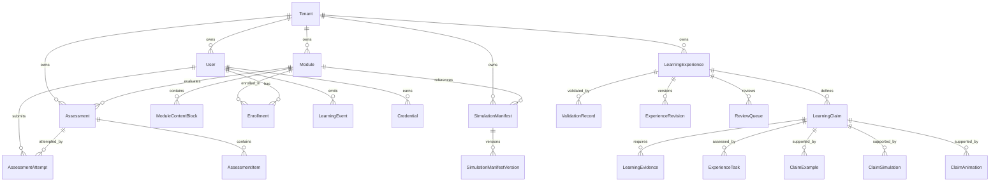

### 5.2 Learning Unit Model

The product spec describes LearningUnit as the canonical pedagogical artifact:

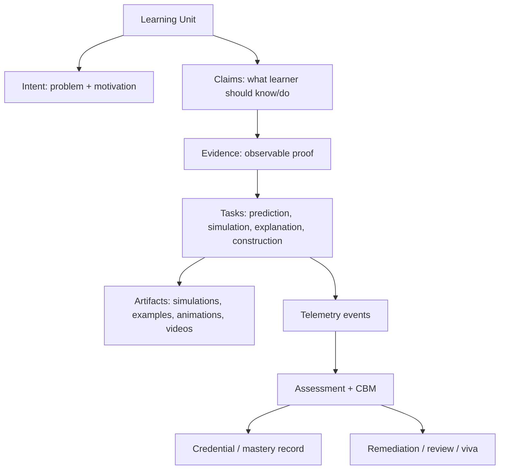

This model is exactly aligned with the strategic shift TutorPutor needs: not “read content then answer quiz,” but “predict, experiment, explain, construct, prove.”

### 5.3 Content Generation and Validation Pipeline

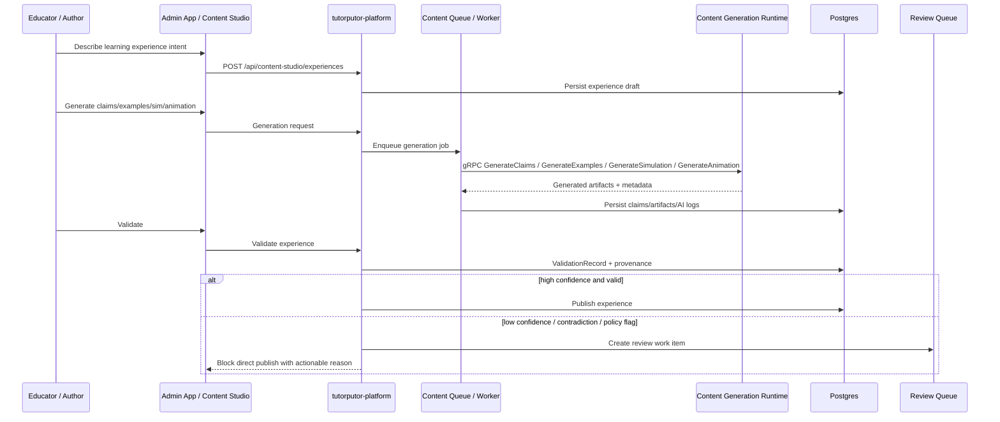

### 5.4 Simulation Authoring Flow

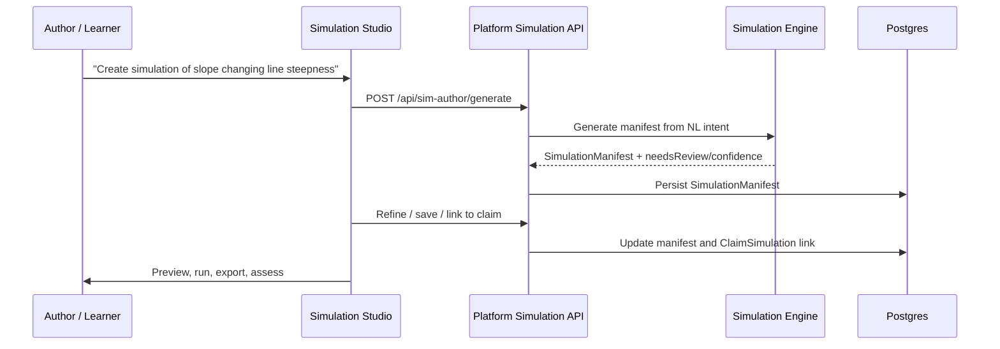

### 5.5 Assessment and Evidence Flow

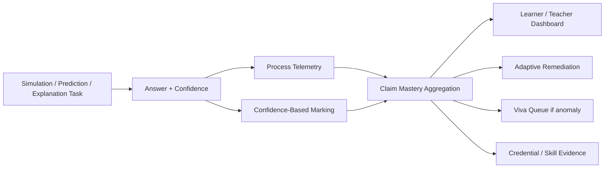

---

## 6. What Is Already Done

The following items appear implemented or substantially implemented in the latest `ghatana` repo based on current-state and remediation evidence.

### 6.1 Platform and API

| Capability | Status | Notes |
|---|---|---|
| Consolidated `tutorputor-platform` backend | Done / active | Current state describes a Fastify/Node backend replacing 28 former microservices. |
| API gateway | Done | Gateway acts as main client entrypoint and delegates to platform. |
| Canonical API route surface | Mostly done | `/api/v1/*` broadly standardized; `/api/content-studio` and `/api/sim-author` remain product-specific. |
| Health and metrics | Done | Deployment docs and compose expose health/metrics surfaces. |
| Request context hardening | Improved | Remediation says missing tenant/user context now fails closed in key helpers. |
| JWT + SSO auth | Implemented | Current state says JWT validation, SSO/OIDC, tenant claims, and current-user routes are implemented. |
| Refresh/logout routes | Implemented | Remediation says these routes were already present/fixed. |
| RBAC | Partial but improved | Role checks exist for many route groups; platform-wide ABAC still planned. |

### 6.2 Learner Experience

| Capability | Status | Notes |
|---|---|---|
| Learner dashboard | Implemented | Calls `/api/v1/learning/dashboard`. |
| Module discovery/search | Implemented | Canonical browse surface is `/search`; module list redirects. |
| Module detail | Implemented | Calls `/api/v1/modules/:slug`. |
| Pathways | Implemented | Calls `/api/v1/pathways`. |
| Assessments | Implemented | Calls `/api/v1/assessments`. |
| Omnipresent AI tutor | Implemented | AI tutor routed through dashboard flow. |
| Marketplace browse/purchase | Implemented | Wired to marketplace and billing APIs; mock checkout in local/dev. |
| Simulation studio | Implemented | Re-enabled route. |
| Animation editor | Implemented | Re-enabled route. |
| Analytics dashboard | Implemented | Re-enabled route. |
| Learner E2E coverage | Improved | Remediation reports canonical learner Playwright tests passing. |

### 6.3 Admin Authoring and Content Studio

| Capability | Status | Notes |
|---|---|---|
| Content Studio CRUD | Implemented | Experience creation, update, validation, publish. |
| Evidence-based validation | Implemented | Current state describes per-claim artifact/task checks and pillar scoring. |
| Publish gating | Implemented | Validates first and blocks with actionable errors when `canPublish=false`. |
| Manual review gate | Improved | Remediation says low confidence or contradictory evidence creates review work items and lifecycle events. |
| Examples linked to claims | Implemented | `ClaimExample` query route. |
| Simulations linked to claims | Implemented | `ClaimSimulation` upsert and sim-author link APIs. |
| Animations linked to claims | Implemented | `ClaimAnimation` and saved specs through existing routes. |
| Comprehensive content view | Implemented | Returns experience plus artifacts. |
| Authoring page live API integration | Improved | Current state says library refresh/delete, claim/task/settings, animation and simulation persistence use live APIs. |
| Publish provenance | Improved | Remediation says validation metadata, evidence confidence, and AI context are captured. |

### 6.4 Simulation Engine and Rendering

| Capability | Status | Notes |
|---|---|---|
| Simulation-first product model | Implemented in architecture/spec | Product spec explicitly defines simulation-first experimentation. |
| Multi-domain simulation contracts | Implemented | Product spec describes eight domains and manifest/entity models. |
| NL manifest generation | Implemented | `/api/sim-author/generate`. |
| NL manifest refinement | Implemented | `/api/sim-author/refine`. |
| Parameter suggestions | Implemented | `/api/sim-author/suggest`. |
| Manifest persistence | Implemented | `SimulationManifest` create/load/update and claim linking. |
| Simulation engine library | Implemented / broad | Kernels, renderers, SDK, authoring, NL/refinement engine are present in spec. |
| Deterministic execution requirement | Specified | Needs ongoing proof through regression suites. |

### 6.5 AI and Content Generation

| Capability | Status | Notes |
|---|---|---|
| Platform AI client | Implemented | gRPC client includes typed interfaces, circuit breaker, logging, fallbacks. |
| Real worker gRPC client | Implemented | `RealContentGenerationClient` handles proto resolution, retries, normalization, response transforms. |
| Content generation runtime | Improved | Compose includes `content-generation` service; remediation reports launcher health/readiness smoke tests passed. |
| Ollama/local LLM support | Implemented in docs/topology | AI environment and Ollama guides exist. |
| Async generation jobs | Implemented | Current state says BullMQ queue and progress polling are implemented. |
| AI route strict context | Improved | Remediation says AI routes no longer fabricate default tenant/anonymous user. |

### 6.6 Enterprise / Platform Capabilities

| Capability | Status | Notes |
|---|---|---|
| Multi-tenancy | Implemented / improved | Tenant context and ownership checks improved; direct domain-pack visibility enforced. |
| SSO providers | Implemented | Tenant SSO provider CRUD. |
| LTI 1.3 | Implemented | Launch, JWKS, config, deep-linking, grade passback, platform CRUD. |
| Stripe payments | Implemented / partial | Subscription routes and webhook implemented; billing portal remains 501 until configured. |
| Notifications | Implemented | Read/mark-read/preferences, email/push, device token lifecycle. |
| VR labs | Implemented | Routes and models described as implemented. |
| Kernel registry | Implemented | Persisted via Prisma model. |
| Audit/compliance | Implemented / improved | Data export/deletion, tenant-bound compliance export checks, audit routes. |
| CI pipeline | Implemented intent | CI workflow validates shared packages, tests with coverage, builds images, runs Trivy scan. |

---

## 7. What Still Needs To Be Done

### 7.1 P0 — Establish a Single Current Truth Surface

The repo has multiple documents with conflicting readiness signals:

- `CURRENT_STATE.md` claims broad implementation and some clean validation.
- March module inventory shows many modules failing gates.
- April audit identifies serious trust and runtime gaps.
- April remediation says many audit items were fixed and tests passed.
- `tsc_probe.txt` contains many compiler errors, but may be stale.

**Required action:** Generate a fresh `products/tutorputor/docs/architecture/CURRENT_VERIFICATION_STATUS.md` from CI, not manually. It should include:

- Commit SHA.
- Date/time.
- Exact commands run.
- Pass/fail per package/module.
- Typecheck, lint, unit, integration, E2E, security scan, build status.
- Known skipped tests and why.
- Links to logs/artifacts.

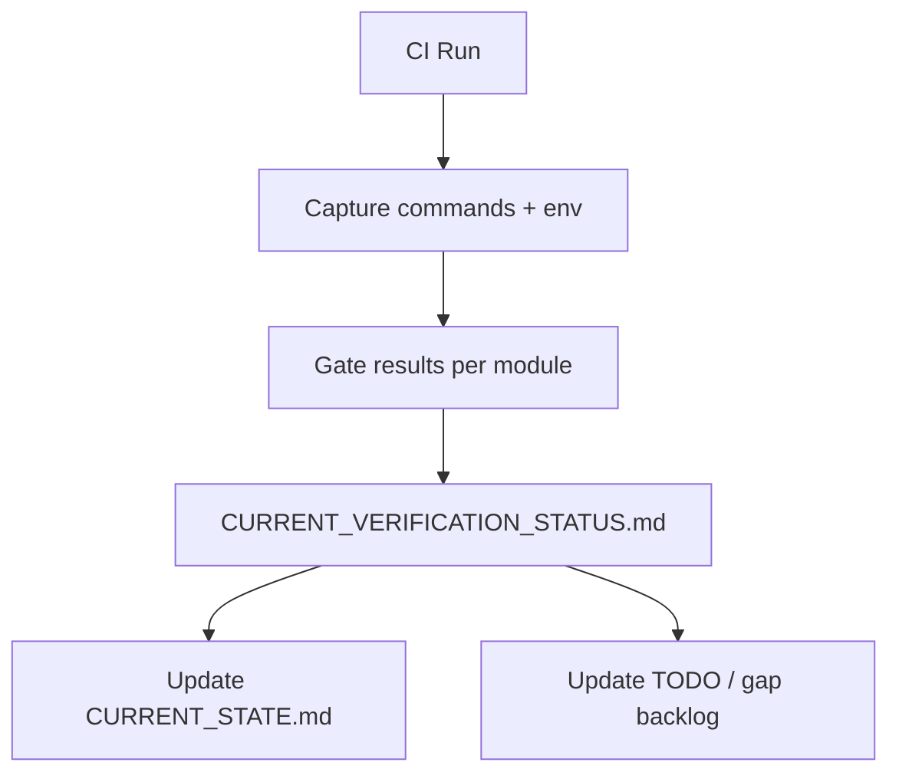

### 7.2 P0 — Prove Fail-Closed Auth, Tenant, and Consent Runtime

Remediation says critical auth/consent issues were fixed. That is good, but production trust requires non-negotiable regression coverage:

- Every protected API must reject missing token/user/tenant context.
- Trusted-proxy headers must be disabled by default and allowed only with internal-only shared secret and network boundary controls.
- Consent middleware must be registered for AI, analytics, third-party sharing, and high-risk processing routes.
- Cross-tenant access must be tested with malicious IDs.
- Public routes (LTI JWKS/config/webhook) must be explicitly documented and tested.

**Required tests:**

| Test Class | Required Coverage |
|---|---|
| Auth integration tests | missing token, expired token, wrong tenant, wrong role, forged header, trusted proxy disabled/enabled |
| Consent integration tests | no consent, revoked consent, minor consent, AI route, analytics route, third-party route |
| Tenant isolation tests | user A tenant X cannot access tenant Y resources by ID |
| RBAC/ABAC tests | student/teacher/admin/superadmin matrix for each route family |

### 7.3 P0 — Prove Content Generation Runtime Operability

The architecture depends heavily on AI/content generation. It must not silently degrade in production-like validation.

**Required actions:**

- Content generation service must have full lifecycle: config validation, startup, health, readiness, gRPC service registration, graceful shutdown.
- Platform must fail fast if generation is required but worker/gRPC/queue is unavailable.
- Queue/worker must be enabled in at least one canonical CI profile.
- Generation job lifecycle must be tested end-to-end:
  - enqueue job
  - worker consumes job
  - gRPC call succeeds
  - generated claims/examples/simulations/animations persisted
  - validation runs
  - provenance captured
  - publish gate behaves correctly

### 7.4 P0 — Replace Stale Compiler Probe With Fresh Typecheck Evidence

`tsc_probe.txt` shows extensive compiler errors across core, simulation, platform, content, audit, auth, auto-revision, compliance, content generation, and contract imports. Later current-state/remediation docs suggest many issues have been fixed.

**Required action:** Do not leave stale failing probe artifacts in the repo without status. Either:

1. Delete/replace stale probe files after successful CI, or
2. Rename them under `docs/archive/` with date and context, or
3. Add a generated `latest-typecheck-status.json` and make stale probes clearly non-authoritative.

### 7.5 P1 — Golden Dataset and Independent Content Evaluation

TutorPutor’s highest value is trustworthy learning, not just content generation. The next architecture layer should include independent validators.

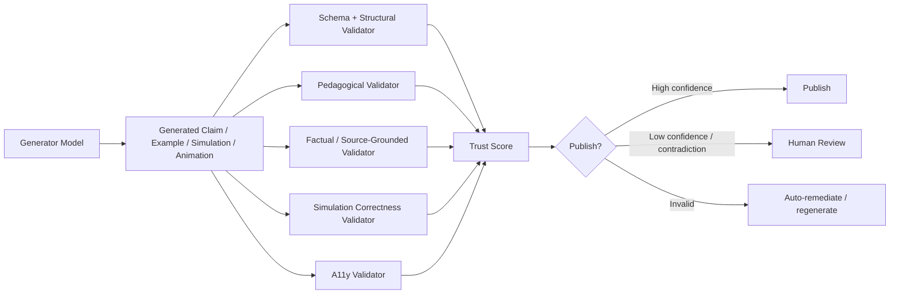

**Needed components:**

- Domain golden datasets for math, physics, chemistry, biology, medicine, economics/business, CS.
- SME-reviewed claim/evidence/task examples.
- Scientific simulation sanity suites.
- Misconception benchmark sets.
- Adversarial hallucination tests.
- Model version and prompt version registry.
- Provenance graph per generated assertion.
- Regression scorecards over time.

### 7.6 P1 — Deterministic Simulation Correctness Harness

The product spec describes deterministic simulation and multi-domain kernels. Production trust requires domain-specific replay tests:

| Domain | Correctness Needed |
|---|---|
| Math | graph transformations, parameter constraints, seeded outputs, algebraic correctness |
| Physics | energy/force sanity, units, time-step stability, collision bounds, vector consistency |
| Chemistry | valence/bond sanity, reaction constraints, molecular visualization correctness |
| Biology/Medicine | physiological plausibility, safety constraints, intervention effects bounded |
| Economics/Business | supply/demand equilibrium, surplus/DWL calculations, no impossible negative states without explanation |
| CS | algorithm state transitions, truth table correctness, scheduling metrics |

### 7.7 P1 — UX Simplification Around Core Journeys

TutorPutor has many implemented routes and features. That breadth can become cognitive overload.

Primary learner UX should reduce to:

1. Continue learning.
2. Try simulation.
3. Make prediction and confidence selection.
4. Run and observe.
5. Explain what happened.
6. Get feedback/remediation.
7. Prove mastery.

Primary author UX should reduce to:

1. Describe what to teach.
2. System generates claims/evidence/tasks/artifact plan.
3. Author reviews one structured plan.
4. System auto-generates missing artifacts.
5. System validates and explains gaps.
6. Author approves, requests revision, or sends to SME review.
7. Publish with provenance.

### 7.8 P1 — ABAC and Resource Ownership Completion

Current state shows RBAC and many resource ownership checks improved, but platform-wide ABAC is still planned.

Needed:

- Central policy engine for actor/resource/action/context decisions.
- Explicit policy docs per route family.
- Tenant-scoped resource lookup helpers only; forbid direct raw IDs without tenant binding.
- Consistent self-or-privileged checks.
- Audit log for all denied and allowed sensitive operations.

### 7.9 P2 — Observability and SLO Maturity

Existing health/metrics/tracing are useful. Next stage:

- Define SLOs per critical journey:
  - learner dashboard load
  - module detail load
  - tutor query
  - content generation job completion
  - publish validation
  - simulation render start
  - LTI launch
  - payment checkout
- Add alert policies tied to user impact.
- Add dependency health dashboard: database, redis, content-generation, LLM provider, Stripe, LTI, email/push.
- Add audit/provenance dashboards for content trust.

### 7.10 P2 — Dependency and Reuse Hardening

The repo has shared packages, but app-local duplication remains a risk. Continue enforcing:

- No duplicate UI primitives across web/admin/mobile.
- Shared auth client/token lifecycle.
- Shared API client generated from contracts.
- Shared validation schemas.
- Shared design system and accessibility patterns.
- Shared telemetry/event contracts.

---

## 8. Architecture Risk Register

| Risk | Severity | Current Evidence | Remediation |
|---|---:|---|---|
| Conflicting truth surfaces | P0 | Current state, module inventory, audit, remediation, and tsc probe disagree | Generate CI-backed current verification report |
| Auth/tenant/consent fail-open regression | P0 | Audit found issues; remediation claims fixes | Keep permanent integration/E2E tests and fail-closed defaults |
| AI/content generation silently degraded | P0 | Audit found optionalized/conditional runtime; compose now has content-generation profile | Enforce required dependency mode in CI and production-like tests |
| Generated content correctness | P1 | Validation/publish gates exist, but golden datasets and evaluator governance remain | Build independent evaluator + golden benchmark architecture |
| Simulation scientific correctness | P1 | Simulation-first architecture exists; deterministic correctness needs proof | Domain replay and sanity harness |
| UI/UX complexity | P1 | Many features/routes/dashboards | Collapse around core learner/author journeys |
| ABAC incomplete | P1 | Current state says broad RBAC improved; platform-wide ABAC planned | Central policy engine and route matrix |
| Stale artifacts misleading maintainers | P1 | `tsc_probe.txt` exists with errors; later docs claim clean | Archive stale diagnostics or regenerate automatically |
| Mobile production readiness | P2 | Mobile foundation present; remediation fixed tenant fabrication; broader mobile E2E still needed | Secure storage, offline sync, real auth, mobile E2E |
| Payment/billing completeness | P2 | Stripe subscription/webhooks implemented; billing portal 501 until configured | Configure portal or hide feature until ready |

---

## 9. Target Architecture Additions

### 9.1 Trustworthy AI Content Layer

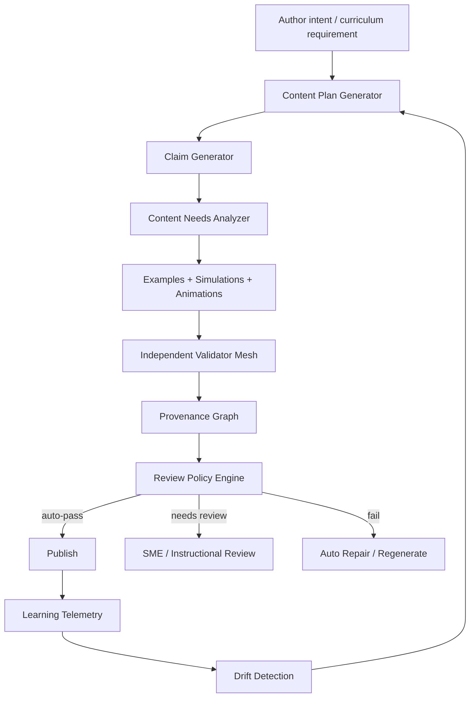

### 9.2 Learning Evidence Graph

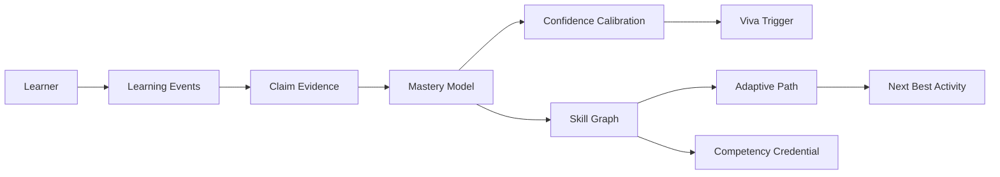

### 9.3 Policy and Governance Layer

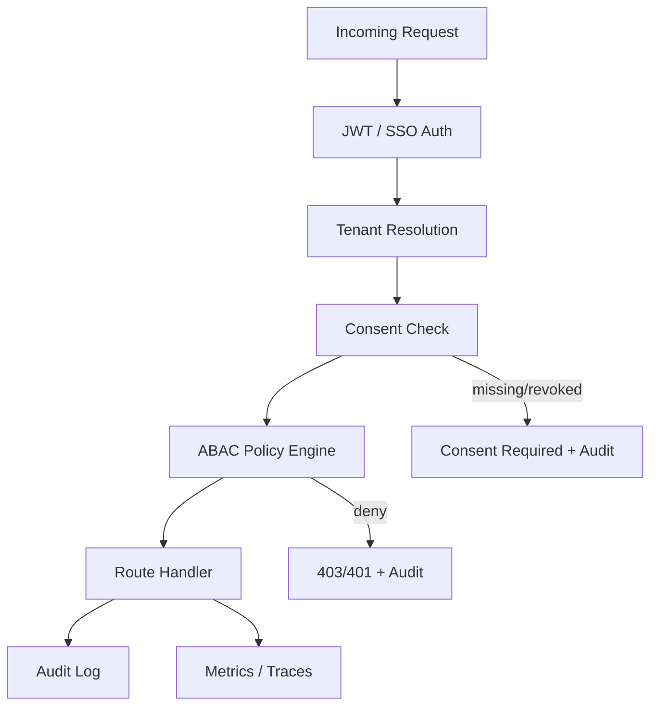

---

## 10. Recommended Execution Roadmap

### Phase 0 — Truth Consolidation and Build Confidence (1 week)

1. Run full CI on latest `main` and produce generated status doc.
2. Resolve or archive `tsc_probe.txt` and module inventory stale status.
3. Produce route inventory from actual platform registration.
4. Produce package inventory with pass/fail status from commands.
5. Make `CURRENT_STATE.md` reference generated status artifacts.

### Phase 1 — P0 Trust Gates (1–2 weeks)

1. Auth/tenant/consent fail-closed regression suite.
2. Required dependency mode for content generation runtime.
3. Queue + worker + gRPC integration test.
4. Content publish provenance and manual review gating regression.
5. Public route allowlist and security tests.

### Phase 2 — Content and Simulation Trust (2–4 weeks)

1. Golden datasets for first two domains: Math and Physics.
2. Independent evaluator service for claims/examples/explanations.
3. Deterministic simulation replay harness.
4. Generated artifact provenance graph.
5. Regression reports for generated content quality.

### Phase 3 — UX Simplification (2–4 weeks)

1. Learner journey simplification: dashboard → simulation → evidence → remediation.
2. Authoring journey simplification: intent → plan → auto-generate → validate → review/publish.
3. Persona-specific dashboards: learner, teacher, author, institution admin, operator.
4. Reduce overlapping routes and low-value dashboards.
5. Embed AI invisibly as workflow automation, not as separate “AI feature” where avoidable.

### Phase 4 — Production Operability (2–4 weeks)

1. SLOs and alert policies per critical journey.
2. Runbooks for queue/gRPC/LLM/Stripe/LTI incidents.
3. Load/performance tests for dashboard, AI tutor, content generation, simulation start.
4. Backup/restore drills and DR verification.
5. Security scanning, dependency license compliance, and penetration test checklist.

---

## 11. Acceptance Criteria for “Production Ready”

TutorPutor should not be called production-ready until all of the following are true:

| Gate | Acceptance Criteria |
|---|---|
| Build | All packages typecheck/lint/build clean with no unexplained stale probe errors. |
| Unit tests | Coverage thresholds met for platform, contracts, core, simulation, web/admin critical logic. |
| Integration tests | Auth, tenant, consent, content generation, queue/worker/gRPC, DB, Redis all tested. |
| E2E tests | Learner login/dashboard/module/assessment/simulation and admin authoring/validate/publish pass on live stack. |
| Security | No trusted header bypass outside explicit internal-only mode; RBAC/ABAC matrix tested. |
| Privacy | Consent enforcement active and tested for AI/analytics/third-party routes. |
| AI generation | Full job lifecycle tested with real or controlled local model provider. |
| Content trust | Independent validation + provenance + review gates implemented for generated artifacts. |
| Simulation trust | Deterministic replay and domain correctness suites pass. |
| Observability | SLO dashboards and alerts exist for critical journeys. |
| Deployment | Docker/K8s startup, health, readiness, graceful shutdown, migrations, rollback validated. |
| Documentation | Current state generated from CI and aligned with architecture docs. |

---

## 12. Final Architecture Assessment

TutorPutor in the latest `samujjwal/ghatana` repo is a far more mature, better organized, and more strategically aligned platform than the older repo snapshot. It has moved toward a strong consolidated architecture with real product surfaces, broad route coverage, content authoring, simulation authoring, AI integration, enterprise integration, and remediation of several serious audit issues.

The most important architectural shift now is from **feature completeness** to **trust completeness**.

The platform should be judged not by how many routes, models, or modules exist, but by whether it can reliably prove:

1. The learner actually learned.
2. The generated content is correct, age-appropriate, accessible, and pedagogically sound.
3. The simulation behaves correctly and reproducibly.
4. The AI reduced human burden without hiding risk.
5. The system enforces privacy, consent, security, and tenant boundaries by default.
6. The product remains simple enough for learners and educators to use without cognitive overload.

**Recommended positioning:**

> TutorPutor is an AI-native, simulation-first learning evidence platform that helps learners develop reasoning, judgment, confidence calibration, and real-world skill in an AI-abundant world.

**Recommended next engineering theme:**

> Move from “implemented features” to “validated, trustworthy, low-cognitive-load learning outcomes.”

---

## Appendix A — Done / Partial / Todo Summary

### Done / Strong

- Consolidated platform architecture.
- API gateway and local topology.
- Learner web app route surface.
- Admin authoring app route surface.
- Content Studio CRUD, validation, publish gates.
- Claims/examples/simulations/animations linkage.
- Simulation authoring/generation/refinement/persistence.
- AI client and worker gRPC client.
- JWT/SSO baseline.
- LTI, marketplace, billing, notifications, VR routes.
- Current-state and audit documentation.
- Targeted remediation tests reported in April 20 doc.

### Partial / Needs Continuous Verification

- Platform-wide ABAC.
- Golden-dataset content validation.
- Simulation scientific correctness suites.
- End-to-end AI/content worker runtime proof.
- Fresh CI truth surface.
- Mobile production readiness.
- Deep learner outcome analytics.
- UX simplification.
- Operational SLOs and alerts.

### Todo / High Impact

- CI-generated current verification report.
- Archive or regenerate stale diagnostic artifacts.
- Independent evaluator architecture.
- Provenance graph for every generated assertion/artifact.
- Deterministic simulation replay harness.
- Cross-tenant malicious-access test suite.
- Consent enforcement full-route regression suite.
- Complete learner and author “zero cognitive load” UX pass.
- Production-grade runbooks and SLO dashboards.

